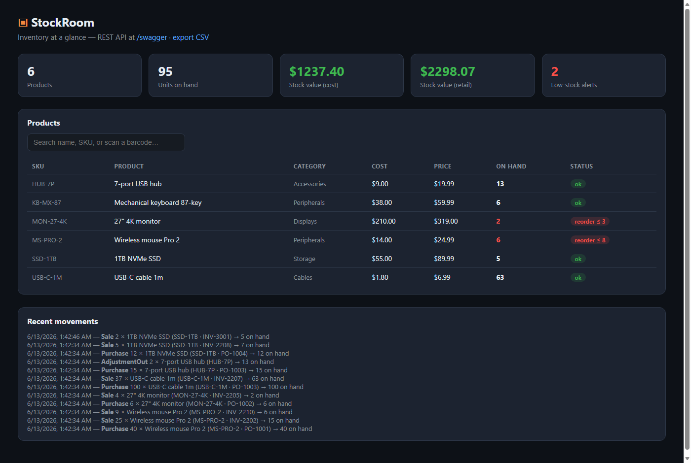
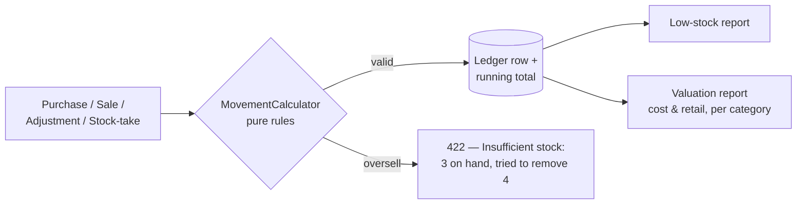

# ▣ StockRoom

**Small-business inventory API** — products, an append-only stock ledger, low-stock alerts, valuation reports, barcode lookup, and CSV import/export that round-trips a shop's existing Excel sheet. Built for the store still tracking stock in a notebook.

Built with **.NET 9, EF Core (SQLite)** — API-first with Swagger, plus a zero-dependency live dashboard.



## Design: the ledger is the truth

Stock isn't a number you edit — it's the **sum of movements** (purchase, sale, adjustment in/out, stock-take). Every change writes a ledger row with the resulting quantity, so any stock level is auditable back to the receipt or invoice that caused it:



- **Oversell-proof**: a sale that would drive stock negative is rejected with the exact reason — no silent negative inventory.
- **Stock-takes are movements too**: a physical count sets the level *via the ledger*, so even corrections leave a trail. CSV imports apply counts the same way.
- **Barcode-ready**: USB scanners act as keyboards — `GET /api/products/by-barcode/{code}` resolves a scan (barcode or SKU) in one call; the dashboard search accepts scans directly.

## Quick start

```bash
git clone <this repo>
cd StockRoom
dotnet run --project src/StockRoom --urls http://localhost:5210
# → http://localhost:5210          (dashboard)
# → http://localhost:5210/swagger  (REST API)
```

Zero setup — schema plus a small electronics shop (6 products with purchase/sale history, 2 already at reorder level) are seeded on first run.

### Docker

```bash
docker compose up --build
# → http://localhost:8080
```

### Deploy to Render (free)

[](https://render.com/deploy?repo=https://github.com/talhaali64/StockRoom)

One click → a live demo on Render's free tier, pre-seeded with a sample shop (including low-stock items) so the dashboard and reports populate immediately.

## REST API

| Method | Route | Purpose |
|---|---|---|
| `GET/POST/PUT/DELETE` | `/api/products` | Product CRUD (`?search=` `?category=` `?lowStockOnly=true`) |
| `GET` | `/api/products/by-barcode/{code}` | Scanner lookup (barcode or SKU) |
| `POST` | `/api/products/{id}/movements` | Apply Purchase / Sale / AdjustmentIn / AdjustmentOut / StockTake |
| `GET` | `/api/products/{id}/movements` | Per-product audit ledger |
| `GET` | `/api/movements` | Recent activity across all products |
| `GET` | `/api/reports/low-stock` | At/below reorder level, most urgent first |
| `GET` | `/api/reports/inventory-value` | Valuation at cost & retail, per category |
| `GET` | `/api/products/export.csv` | Excel-friendly export |
| `POST` | `/api/products/import` | CSV upsert by SKU (body: `text/csv`) |
| `GET` | `/api/health` | Health check |

CSV import/export uses SKU as the natural key — export, edit in Excel, re-import: no duplicates, bad rows are reported per-line without aborting the batch, and imported counts are applied as stock-take movements.

## Architecture notes

- **`MovementCalculator` is pure** — one function defines how every movement kind changes stock; the oversell rule lives in exactly one place.
- **Hand-rolled RFC-4180 CSV** (quoted fields, embedded commas/quotes/newlines) — small, dependency-free, and fully tested, because shop spreadsheets are never clean.
- **SQLite + `EnsureCreated`** for zero-setup demos; swap the provider in one line for Postgres.

## Tests

```bash
dotnet test
# 21 tests: movement math per kind, oversell protection, CSV edge cases,
# import upserts + error reporting, low-stock ordering
```

## Tech stack

.NET 9 · ASP.NET Core · EF Core 9 (SQLite) · Swashbuckle/Swagger · xUnit · Docker

---

*Portfolio project by Talha — backend & automation engineering. Extensions per client: multi-location stock, purchase orders & suppliers, receipt printing, POS integration, role-based auth.*
